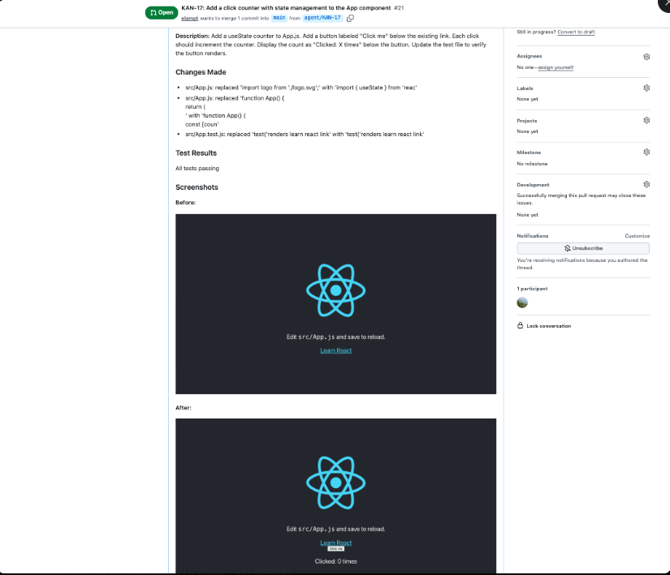
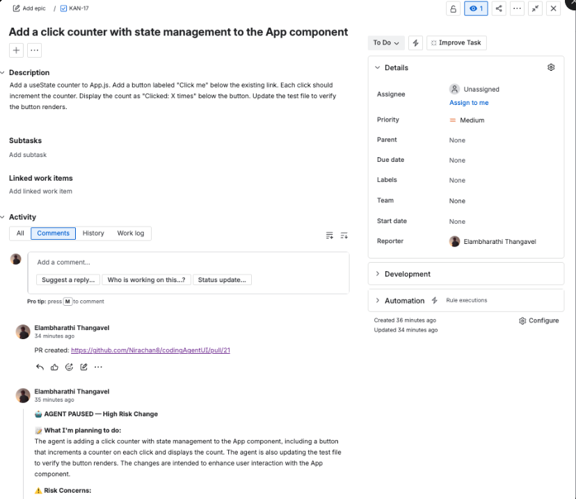
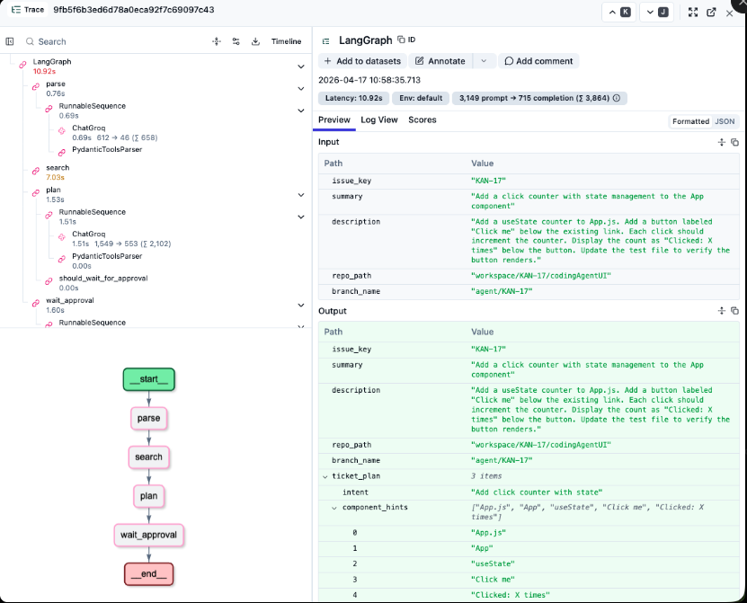
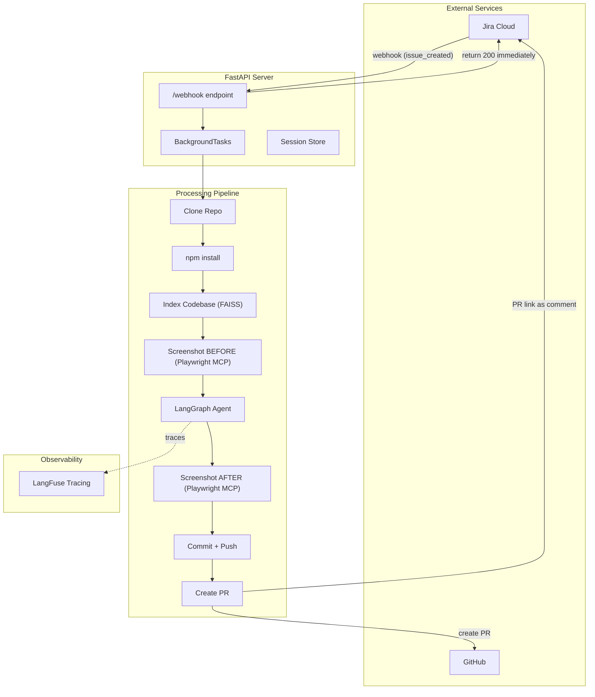
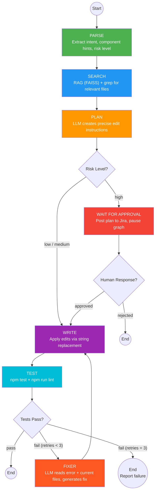
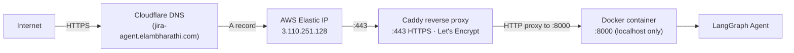

# Jira Coding Agent

An AI agent that watches Jira for new tickets, autonomously modifies a React frontend codebase, runs tests with self-healing, takes visual before/after screenshots via Playwright MCP, and creates pull requests — with human-in-the-loop approval for high-risk changes and full LangFuse observability.

> **Live deployment:** [https://jira-agent.elambharathi.com/health](https://jira-agent.elambharathi.com/health) (AWS EC2, ap-south-1)
>
> **Demo video:** [Watch the full demo on Loom](https://www.loom.com/share/96e206ad8dea4aee9d2c5ea69d9fe5c3)

## In Action

### PR with Before/After Screenshots
The agent creates a PR with inline visual verification — reviewers see exactly what changed in the UI.



### Human-in-the-Loop Approval on Jira
High-risk changes pause and post an LLM-generated plan with risk concerns. The human approves or rejects directly on Jira.



### Full LLM Observability via LangFuse
Every LLM call is traced — prompts, responses, latencies, token counts. The agent flow is visible as a graph.



## Architecture



## LangGraph Agent Flow



## Features

| Feature | Description |
|---------|-------------|
| **Jira Webhook Integration** | Automatically triggered when a Jira ticket is created |
| **LangGraph State Machine** | Agent with distinct nodes: parse, search, plan, write, test, fix |
| **RAG + Grep Search** | Semantic search (FAISS) + exact string match for finding relevant code |
| **Self-Healing Loop** | Tests fail → LLM diagnoses error → fixes code → retests (max 3 retries) |
| **Visual Verification** | Before/after screenshots via Playwright MCP, embedded in PR description |
| **Human-in-the-Loop** | High-risk changes pause for approval; LLM-generated plan posted to Jira |
| **LangFuse Observability** | Every LLM call traced — prompts, responses, latencies, token counts |
| **Config-Driven** | Swap LLM provider, target repo, test commands via YAML — zero code changes |
| **Honest Failures** | Agent reports when it can't fix something instead of committing broken code |

## Tech Stack

| Layer | Tools |
|-------|-------|
| **Agent Framework** | LangGraph, LangChain |
| **LLM** | Llama 3.3 70B via Groq (free) — config-swappable to Claude / GPT-4 |
| **Server** | FastAPI, uvicorn |
| **Package Manager** | UV (modern Rust-based, replaces pip + venv) |
| **Code Quality** | Ruff (lint + format), PyRight (static type checking) |
| **Build Automation** | Makefile (one-command workflows) |
| **Containerization** | Docker (multi-stage build, ~800 MB image, non-root user) |
| **Deployment** | AWS EC2 (t3.micro, ap-south-1), Elastic IP, Caddy reverse proxy, Let's Encrypt HTTPS |
| **RAG** | FAISS, sentence-transformers (all-MiniLM-L6-v2, CPU-only torch) |
| **Visual Testing** | Playwright via MCP (Anthropic's Model Context Protocol) |
| **Observability** | LangFuse |
| **Integrations** | Jira REST API, GitHub API (PyGithub), Git (GitPython) |
| **Validation** | Pydantic (structured LLM output + webhook payload validation) |

## Production Deployment

The agent is deployed on AWS EC2 in `ap-south-1` (Mumbai) with HTTPS termination at the edge.



### Production Stack

| Layer | Choice | Why |
|-------|--------|-----|
| Compute | EC2 t3.micro | AWS free tier (after free tier: ~$8/mo) |
| Storage | 30 GB gp3 EBS + 2 GB swap | Fits container (~800 MB) + workspace + node_modules |
| Networking | Elastic IP | Stable IP across instance restarts |
| DNS | Cloudflare (DNS-only, not proxied) | Custom subdomain pointing at Elastic IP |
| TLS | Caddy + Let's Encrypt | Auto cert issuance + renewal, zero config |
| Reverse proxy | Caddy | Single tool, 3-line config |
| Container runtime | Docker (auto-restart unless-stopped) | Survives EC2 reboots automatically |

### Production Hardening

| Concern | Mitigation |
|---------|-----------|
| Backend exposed to internet | Container binds to `127.0.0.1:8000` only — Caddy is the only entry point |
| Secrets in image | `.env` mounted at runtime as read-only volume |
| Container runs as root | Dockerfile creates non-root `appuser` |
| Container crashes | `--restart unless-stopped` policy |
| EC2 reboots | Docker daemon `systemctl enable`'d |
| Image size bloat | Multi-stage build + CPU-only torch (6 GB → 800 MB, 87% reduction) |
| HTTPS cert renewal | Caddy auto-renews ~30 days before expiry |
| SSH brute-force | Security group restricts port 22 to my IP |

### Image Size Optimization

The default torch package ships with ~4.5 GB of nvidia/CUDA libraries unnecessary for CPU-only EC2 deployment. The agent uses `[tool.uv.sources]` to route torch to PyTorch's CPU-only index:

```toml
[[tool.uv.index]]
name = "pytorch-cpu"
url = "https://download.pytorch.org/whl/cpu"
explicit = true

[tool.uv.sources]
torch = { index = "pytorch-cpu" }
```

Result: 6 GB → 800 MB image. Faster builds, faster pulls, lower disk usage.

## Project Structure

```
jira-coding-agent/
├── src/
│   ├── server/
│   │   ├── app.py                  # FastAPI webhook server + pipeline orchestration
│   │   └── models.py              # Pydantic models for Jira webhook payloads
│   │
│   ├── agent/
│   │   ├── graph.py                # LangGraph state machine (nodes + edges + checkpointer)
│   │   ├── state.py                # AgentState TypedDict — data flowing between nodes
│   │   └── nodes/
│   │       ├── parser.py           # PARSE: ticket → intent + risk level
│   │       ├── searcher.py         # SEARCH: RAG + grep → relevant files
│   │       ├── planner.py          # PLAN: ticket + code → edit instructions
│   │       ├── writer.py           # WRITE: apply edits to files on disk
│   │       ├── tester.py           # TEST: run npm test, capture results
│   │       ├── fixer.py            # FIX: diagnose test failure, generate fix
│   │       ├── approver.py         # WAIT: post plan to Jira, pause for approval
│   │       └── screenshotter.py    # SCREENSHOT: capture UI via Playwright MCP
│   │
│   ├── integrations/
│   │   ├── jira_client.py          # Jira API: read tickets, add comments, update status
│   │   ├── github_client.py        # GitHub API: create PRs
│   │   └── git_ops.py              # Git: clone, branch, commit, push
│   │
│   ├── rag/
│   │   ├── chunker.py              # Split codebase into embeddable chunks
│   │   ├── indexer.py              # Embed chunks → FAISS index
│   │   └── retriever.py            # Query FAISS for similar code
│   │
│   ├── mcp/
│   │   └── playwright_client.py    # MCP client for @playwright/mcp server
│   │
│   ├── tools/
│   │   └── dev_server.py           # Start/stop React dev server for screenshots
│   │
│   ├── config.py                   # Load config.yaml + .env secrets
│   └── observability.py            # LangFuse callback handler
│
├── config.yaml                     # Project settings (LLM, repo, commands)
├── pyproject.toml                  # Project metadata + dependencies (PEP 621)
├── uv.lock                         # Pinned dependency versions (reproducible builds)
├── Dockerfile                      # Multi-stage build for production image
├── .dockerignore                   # Excludes secrets, .venv, workspace, etc.
├── Makefile                        # One-command developer workflow
└── .env.example                    # Template for API keys
```

## How It Works

### 1. Simple Change (Low Risk — Fully Autonomous)

```
You create Jira ticket: "Change link text from Learn React to Hello World"
    ↓
Agent: parse → search → plan → write (App.js + App.test.js) → test → pass
    ↓
PR created with before/after screenshots, Jira comment with PR link
```

### 2. Complex Change (High Risk — Human Approval)

```
You create Jira ticket: "Add a click counter with useState"
    ↓
Agent: parse (risk=high) → search → plan → PAUSE
    ↓
Agent posts plan to Jira: "Here's what I'm about to do..." + risk concerns
    ↓
You reply "approve" → agent resumes → write → test → PR
You reply "reject"  → agent cancels cleanly
```

### 3. Test Failure (Self-Heal Loop)

```
Agent writes code → runs tests → FAIL
    ↓
Fixer reads error + current files from disk → generates fix → applies → retests
    ↓ (max 3 retries)
Pass → PR created  |  Still failing → "needs human review" comment on Jira
```

## Setup

### Prerequisites

- Python 3.10+
- Node.js 18+ (for target React repo)
- Jira Cloud account (free tier)
- GitHub account + personal access token
- Groq API key (free at https://console.groq.com)
- LangFuse account (free at https://cloud.langfuse.com) — optional

### Installation

```bash
git clone https://github.com/elampt/jira-coding-agent.git
cd jira-coding-agent

# Install UV (modern Python package manager) if you don't have it
curl -LsSf https://astral.sh/uv/install.sh | sh

# Install all dependencies (creates .venv automatically)
make install

# Copy and fill in your API keys
cp .env.example .env
# Edit .env with your keys
```

### Configuration

Edit `config.yaml` to point to your target repo:

```yaml
target_repo:
  url: "https://github.com/your-org/your-react-app"
  branch_prefix: "agent/"
  test_command: "npm test"
  lint_command: "npm run lint"
  dev_server_command: "npm start"
  dev_server_url: "http://localhost:3000"
```

### Running the Server

**Option A — Local (fast iteration during development):**

```bash
# Terminal 1 — start the FastAPI server with auto-reload
make run
```

**Option B — Docker (matches production environment):**

```bash
# Build the image (first time only; subsequent builds use cache)
docker build -t jira-coding-agent:latest .

# Run the container
docker run -d \
  --name jira-agent \
  -p 8000:8000 \
  -v "$(pwd)/.env:/app/.env:ro" \
  jira-coding-agent:latest

# View logs
docker logs -f jira-agent
```

### Developer Workflow

```bash
make help        # Show available commands
make lint        # Check code style with Ruff
make format      # Auto-format code
make type-check  # Run PyRight type checker
make check       # Run lint + type-check (before committing)
make clean       # Remove workspace, data, screenshots
```

### Setting Up ngrok (Local Development Only)

Jira Cloud needs to send webhooks to your server, but your `localhost:8000` isn't accessible from the internet. **ngrok** creates a public URL that tunnels requests to your local machine.

```bash
# Install ngrok (macOS)
brew install ngrok

# Sign up at https://ngrok.com (free) and add your auth token
ngrok config add-authtoken YOUR_TOKEN

# Terminal 2 — start the tunnel
ngrok http 8000
```

ngrok will display a public URL like `https://abc123.ngrok-free.dev`. This is your webhook URL.

> **For production:** skip ngrok. Run inside Docker on a cloud VM with a real domain. See [Production Deployment](#production-deployment) section above.

### Configuring Jira Webhook

1. Go to your Jira site: `https://your-site.atlassian.net/plugins/servlet/webhooks`
2. Click **Create a Webhook**
3. Fill in:
   - **Name:** `Jira Coding Agent`
   - **URL:** `https://your-ngrok-url.ngrok-free.dev/webhook`
   - **Events:** Check `Issue: created` and `Comment: created`
4. Click **Create**

Now when you create a Jira ticket, Jira sends an HTTP POST to your ngrok URL, which tunnels it to your FastAPI server on `localhost:8000`.

### Verify Everything Works

```bash
# Check server health
curl http://localhost:8000/health
# Should return: {"status": "ok"}

# Watch agent logs in real-time
tail -f /tmp/server.log
```

### Create a Test Ticket

Create a Jira ticket and watch the agent work:

| Field | Value |
|-------|-------|
| **Summary** | `Change the link text from Learn React to Hello World` |
| **Description** | `Update the main link text in the React app` |

Within 2-3 minutes:
- A PR appears on GitHub with before/after screenshots
- A comment on the Jira ticket with the PR link
- A trace in LangFuse showing the full agent execution

## Key Design Decisions

| Decision | Why |
|----------|-----|
| LangGraph over plain LangChain | Need conditional edges (risk routing) + loops (self-heal) + interrupts (approval) |
| RAG + grep together | Semantic search finds "header" when ticket says "navbar"; grep finds exact strings |
| Fewer, larger edits | 7 small dependent edits break easily. One function-body replacement is atomic |
| Playwright via MCP | Anthropic's standardized tool protocol — same interface pattern for any external tool |
| Human-in-the-loop via Jira | Reuse existing webhook. No extra tools. Human stays where they already work |
| Config-driven | Swap LLM provider with one line. Same agent works on any React repo |
| Honest failures | Agent stops and reports after 3 failed fix attempts. Never commits broken code |

## Known Limitations

| Limitation | Mitigation |
|-----------|------------|
| Llama 3.3 struggles with complex refactors | Config-swappable to Claude/GPT-4 for complex tickets |
| No npm install for new dependencies | Planner prompt restricts imports to existing packages |
| Port 3000 collision on concurrent tickets | Sequential processing; dynamic ports for production |
| In-memory session store | Lost on restart; use SQLite for production |
| No webhook authentication | Add HMAC signature verification for production |

## Observability

Every agent run is traced in LangFuse:

- Full node execution tree (parse → search → plan → write → test → ...)
- Every LLM call: exact prompt, response, latency, token count
- Self-heal retries visible as repeated fix → write → test branches
- Human-in-the-loop pauses shown as interrupted nodes

## Inspired By

| Project | What We Learned |
|---------|----------------|
| [Open SWE](https://github.com/langchain-ai/open-swe) | LangGraph as agent framework, tool patterns |
| [SWE-Agent](https://github.com/SWE-agent/SWE-agent) | Simple shell-based tools, minimal approach |
| [OpenHands](https://github.com/OpenHands/OpenHands) | Action → observation → retry pattern |
| [Sweep AI](https://github.com/sweepai/sweep) | Code chunking, sequential pipeline |
